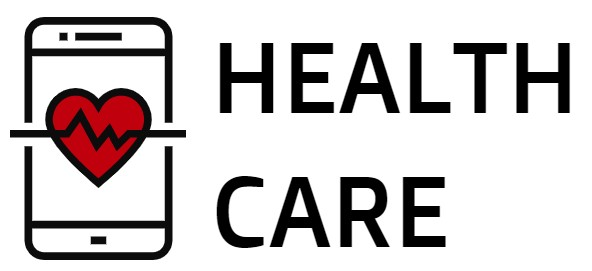

  

# HealthCare - A Health Care Management System

Το παρόν αποτελεί μέρος της εργασίας που είχαμε να εκτελέσουμε στο πλαίσιο του μαθήματος Τεχνολογίας Λογισμικού στο τμήμα Μηχανικών Η/Υ και Πληροφορικής του Πανεπιστημίου Πατρών. Αποφασίσαμε να φτιάξουμε ένα σύστημα πάνω στο οποίο μπορεί να βασίζεται στο Σύστημα Υγείας μίας χώρας. Επιτρέπει την συμμετοχή Ασθενών, Ιατρών και Φαρμακοποιών. Ο κάθε χρήστης μπορεί να εκτελέσει συγκεκριμένες ενέργειες, τις οποίες αναλύουμε στο Documentation. 

# Μέλη Ομάδας (Ονοματεπώνυμο - Αριθμός Μητρώου)
<ul>
  <li>[Φοίβος Αλλαγιώτης - Α.Μ.: 1056636](https://github.com/foivos-all)</li>
  <li>[Αντρέας Παλαμάς - Α.Μ.: 1049789](https://github.com/Apalms)</li>
  <li>[Ορέστης Παρεκκλησίτης - Α.Μ.: 1056646](https://github.com/orestispa)</li>
  <li>[Ηλίας Καρύδης - Α.Μ.: 1056921](https://github.com/ilias-karydis)</li>
</ul>

# Αλλαγές

## 20/04/21 Project-code-v0.1

Προστέθηκαν όλες οι οθόνες που περιλαμβάνουν την διαδικασία εγγραφής και login για τον κάθε χρήστης (εκτός από τον premium). Επίσης, έχουν ανεβεί τα αρχεία που ενώνουν την εφαρμογή με την βάση δεδομένων μας. Παρακάτω έχει ανεβεί το μενού του απλού χρήστη (ασθενή). Κάθε .xml αρχείο δείχνει ένα UI ενώ κάθε .java αρχείο είναι υπεύθυνο για τις λειτουργίες που θα εκτελεί το κάθε UI. Τα .php αρχεία αφορούν την ένωση με την βάση.

## 23/05/21 Project-code-v0.2

Προστέθηκαν τα πλείστα use cases του ασθενή και οι υπόλοιπες οθόνες (UI) των υπόλοιπων χρηστών. Επίσης, προστέθηκαν τα menu των πλείστων χρηστών. Συνολικά μέχρι σήμερα υλοποιήθηκαν τα Use Cases 1, 3, 4, 5, 6 όπως αυτά φαίνονται στο αρχείο Use-Cases-v0.1 που παραδώσαμε.

## 06/06/21 Project-code-v0.3

Προστέθηκαν τα τελευταία use cases του ασθενή και οι υπόλοιπες οθόνες (UI) των υπόλοιπων χρηστών. Επίσης, προστέθηκαν τα menu των υπόλειπων χρηστών. Συγκεκριμένα προστέθηκαν τα menu του γιατρού και του premium ασθενή. Επιπλέον, προστέθηκε η διεπαφή που επιτρέπει στον χρήστη να γίνει premium. Συνολικά μέχρι σήμερα υλοποιήθηκαν τα Use Cases 1, 2, 3, 4, 5, 6, 7, 11, 12, 14, 15, 18 όπως αυτά φαίνονται στο αρχείο Use-Cases-v0.3 που παραδώσαμε.

